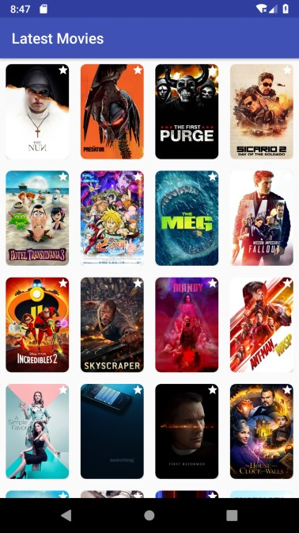
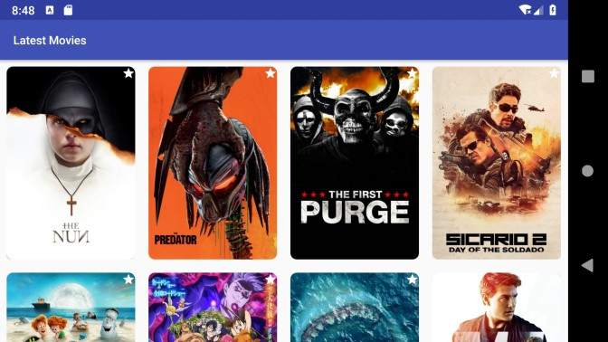
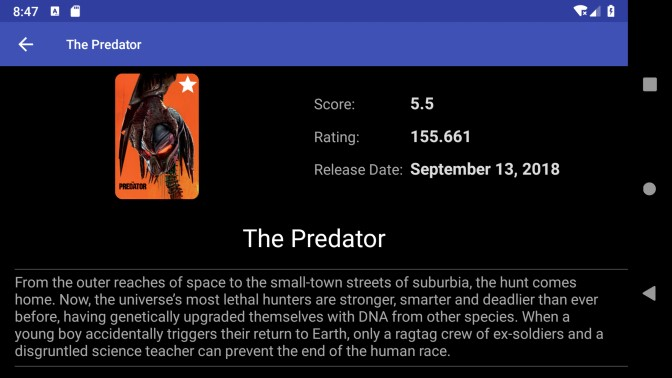

# Switch Movie Grid - Test task for Android developer

### Comments from developer

**Description**

*Initially app was developed as a test task for Android developer.*<br>
*Now I'm using it as a base to test new technologies/libs/ideas.*<br>
*Master branch represent the most resent of them.<br>*
*See [Version-Two](https://github.com/dkrivoruchko/SwitchMovie/tree/version-one) for quite old code,
[Version-One](https://github.com/dkrivoruchko/SwitchMovie/tree/version-one) very old code.<br>*

Application shows now playing movies.<br>
It downloads movies data from [The Movie Database API](http://docs.themoviedb.apiary.io/#) and stores it for offline access.<br>
If data available offline then no request send to server.<br>
User may start/run application offline, available offline data will be shown or error message for failed server request.<br>
Next page data loaded automatically as soon as user scroll to the end of the list.<br>
Pull to refresh feature also available (it rewrite local cache data).<br>
Basic loading animation implemented.<br>
Implemented notification functionality (based on subscription) to notify Presenters for events it's subscribed for.

**Please note:**
* Original task screenshots are from Apple device and are not relevant for android.
* No local cache timeout/invalidation logic. Just store and get.
* Information for movie rating is not available in JSON and no description in documentation found.
* Requirements for landscape layouts are not provided (implemented as I see fit).
* No loading animation for image loading.
* Error handling is very basic.

**Application is based on Clean Architecture and MVP pattern and uses:**
* [Kotlin](https://kotlinlang.org)
* [Kotlin coroutines](https://github.com/Kotlin/kotlinx.coroutines) (Yes, no RxJava - see [version-one](https://github.com/dkrivoruchko/SwitchMovie/tree/version-one) branch for it)
* [Android support libraries](https://developer.android.com/topic/libraries/support-library/index.html)
* [Android Architecture Components](https://developer.android.com/topic/libraries/architecture/index.html) (ViewModel)
* [Kion](https://github.com/Ekito/koin) (Yes, no Dagger 2 - see [version-one](https://github.com/dkrivoruchko/SwitchMovie/tree/version-one) branch for it)
* [Retrofit 2](https://github.com/square/retrofit)
* [Glide 3](https://github.com/bumptech/glide/tree/3.0) / [Glide Transformations](https://github.com/wasabeef/glide-transformations)
* [Binary Preferences](https://github.com/iamironz/binaryprefs)
* [LeakCanary](https://github.com/square/leakcanary)

**Possible things to improve:**

1. Add router to route between activities.
1. Add some online/offline notification.
1. Add loading animation for image loading.
1. Implement some cache timeout/invalidation logic.
1. Add extended and user friendly error handling.
1. Add additional animation between activities.
1. Add tests.
1. Add proguard optimization.

### Screenshots
&nbsp;
<br>
&nbsp;


# Original task decryption
[Switch](https://www.switchapp.com/) is preparing to pivot from helping people find jobs to helping people find movies (just kidding). We want to build an app that displays movies in a grid of thumbnails.


### The Movie Database API

You should use the [The Movie Database API](http://docs.themoviedb.apiary.io/#) to fetch JSON movie data.

In particular, you should use the endpoint that returns [now playing movies](http://docs.themoviedb.apiary.io/#reference/movies/movienowplaying).

You can use this API Key: `ebea8cfca72fdff8d2624ad7bbf78e4c`

**Sample Request**

`http://api.themoviedb.org/3/movie/now_playing?api_key=ebea8cfca72fdff8d2624ad7bbf78e4c`

**Sample Response Snippet**
```json
{
"dates": {
"minimum": "2015-06-03",
"maximum": "2015-07-15"
},
"page": 1,
"results": [
{
"adult": false,
"backdrop_path": "/dkMD5qlogeRMiEixC4YNPUvax2T.jpg",
"genre_ids": [28,12,878,53],
"id": 135397,
"original_language": "en",
"original_title": "Jurassic World",
"overview": "Twenty-two years after the events of Jurassic Park, Isla Nublar now features a fully functioning dinosaur theme park, Jurassic World, as originally envisioned by John Hammond.",
"release_date": "2015-06-12",
"poster_path": "/uXZYawqUsChGSj54wcuBtEdUJbh.jpg",
"popularity": 54.349781,
"title": "Jurassic World",
"video": false,
"vote_average": 7,
"vote_count": 910},
{
"adult": false,
"backdrop_path": "/o4I5sHdjzs29hBWzHtS2MKD3JsM.jpg",
"genre_ids": [878,28,53,12],
"id": 87101,
"original_language": "en",
"original_title": "Terminator Genisys",
"overview": "The year is 2029. John Connor, leader of the resistance continues the war against the machines. At the Los Angeles offensive, John's fears of the unknown future begin to emerge when TECOM spies reveal a new plot by SkyNet that will attack him from both fronts; past and future, and will ultimately change warfare forever.",
"release_date": "2015-07-01",
"poster_path": "/5JU9ytZJyR3zmClGmVm9q4Geqbd.jpg",
"popularity": 50.258717,
"title": "Terminator Genisys",
"video": false,
"vote_average": 6.4,
"vote_count": 168
}
```

**Constructing Poster URLs**

The movie api responses include a field called “poster_path” you will need to construct a full image
url based on the path. The [documentation](http://docs.themoviedb.apiary.io/#reference/configuration/configuration) explains how to do this for various image sizes.
Here’s how you can build urls for 324 pixel wide poster images:

poster_url: `http://image.tmdb.org/t/p/w342 + <poster_path>`

**Example Poster URL**

poster_path: `/5JU9ytZJyR3zmClGmVm9q4Geqbd.jpg`

full_url: `http://image.tmdb.org/t/p/w342/5JU9ytZJyR3zmClGmVm9q4Geqbd.jpg`

### Functionality

You should create a simple app that uses the data from the the Movie Database API and displays the movie poster thumbnails in a grid layout.

**Please follow the designs above as closely as possible.** A keen eye for design details is something we definitely look for.

You should load an initial set of movie data for 20 movies, display those in a grid and when the user scrolls down you should progressively load another set of 20 movies, using the page query parameter:

`http://api.themoviedb.org/3/movie/now_playing?api_key=ebea8cfca72fdff8d2624ad7bbf78e4c&page=2`

You should also implement a detail view that displays a detail view when a user taps on a poster in the grid with a back arrow to return to the grid view.


Support landscape and portrait orientation

### Optional:
* Support pull to refresh
* Support of some kind of local storage so the app can be used without internet connection
* Some kind of loading animation - up to you

Please create a project on github so we can see all the history of your commits.
Use any technology you prefer, try to show skills at making good app architecture.

# License

```
The MIT License (MIT)

Copyright (c) 2017 Dmitriy Krivoruchko

Permission is hereby granted, free of charge, to any person obtaining a copy
of this software and associated documentation files (the "Software"), to deal
in the Software without restriction, including without limitation the rights
to use, copy, modify, merge, publish, distribute, sublicense, and/or sell
copies of the Software, and to permit persons to whom the Software is
furnished to do so, subject to the following conditions:

The above copyright notice and this permission notice shall be included in all
copies or substantial portions of the Software.

THE SOFTWARE IS PROVIDED "AS IS", WITHOUT WARRANTY OF ANY KIND, EXPRESS OR
IMPLIED, INCLUDING BUT NOT LIMITED TO THE WARRANTIES OF MERCHANTABILITY,
FITNESS FOR A PARTICULAR PURPOSE AND NONINFRINGEMENT. IN NO EVENT SHALL THE
AUTHORS OR COPYRIGHT HOLDERS BE LIABLE FOR ANY CLAIM, DAMAGES OR OTHER
LIABILITY, WHETHER IN AN ACTION OF CONTRACT, TORT OR OTHERWISE, ARISING FROM,
OUT OF OR IN CONNECTION WITH THE SOFTWARE OR THE USE OR OTHER DEALINGS IN THE
SOFTWARE.
```